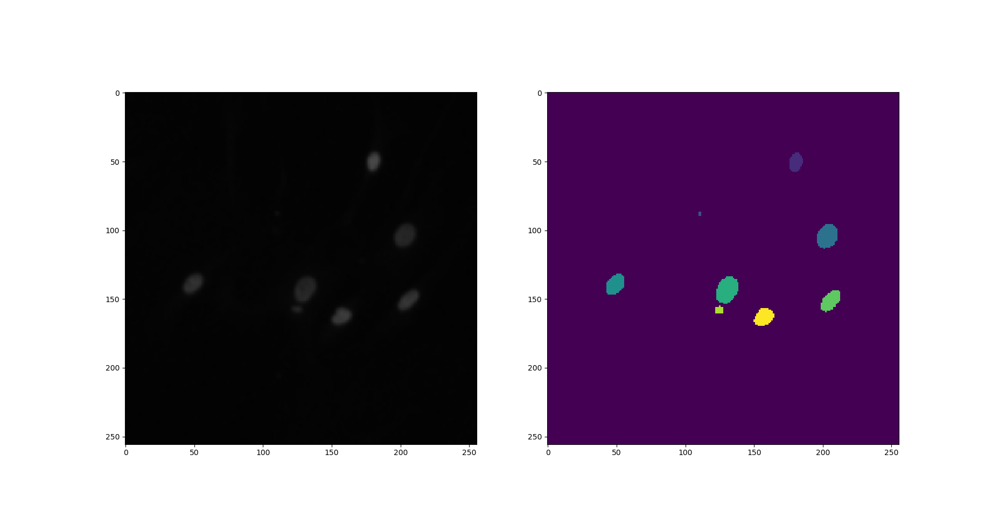
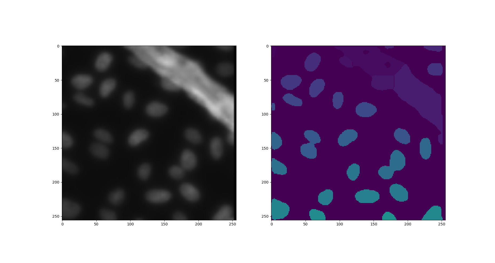
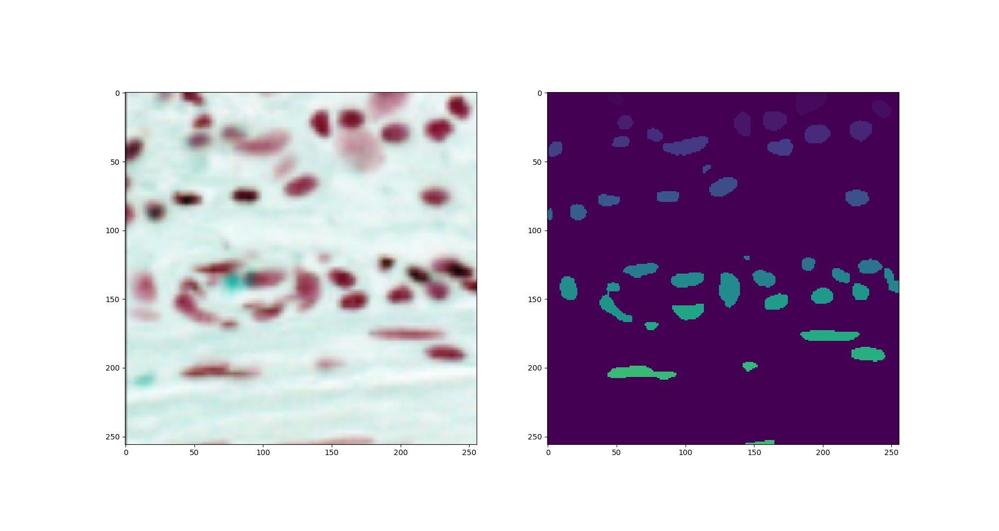

# DSBowl 2018

Proyecto para participar en el concurso DSBowl2018 de Kaggle.

Las predicciones se basan en dos redes neuronales y el algoritmo watershed. Una de ellas realiza una predicción de la mascara completa. La otra de los centros de los objetos para, entre ambas, y el algoritmo watershed separar objetos que se unen.

Para generar resultados o ver resultados de los modelos preentrenados usar el fichero main.py.

Parametros main.py:

**'--dir_database.', '-db.'** Ruta a la carpeta que contiene la base de datos donde dentro las imágenes se dividen en /train y /test (dentro de estas carpetas las carpetas con las identidades). 
**''--visualize.', '-v.', dest='visualize.'** Booleano para visualizar o no las predicciones.

Algunas imágenes de predicciones:

